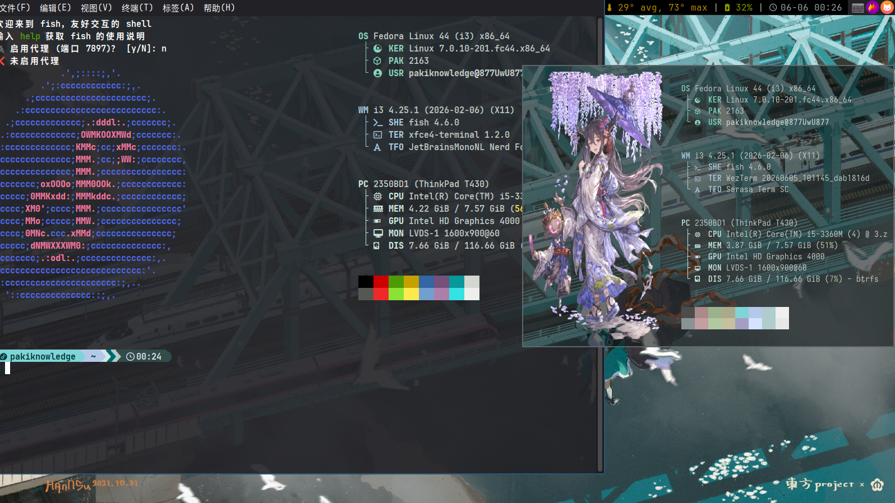
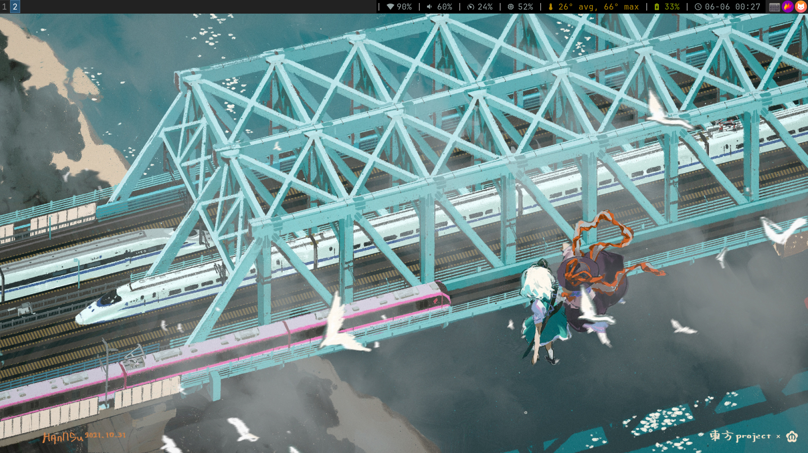

# 8777-i3-config

My i3wm configuration, migrated from Sway.

---
## Preview


## Components / 组件

| Component | Tool |
|-----------|------|
| **WM** | i3 (≥4.22, gaps built-in) |
| **Bar** | i3status / i3status-rust (optional) |
| **Terminal** | WezTerm |
| **Launcher** | Rofi |
| **Notifications** | Dunst |
| **Wallpaper** | Nitrogen |
| **Compositor** | Picom (GLX + vsync) |
| **Shell** | Fish |
| **Prompt** | Starship |
| **Sys Info** | Fastfetch |
| **Screenshot** | Flameshot |
| **Clipboard** | greenclip (history) + X11 native |
| **File Manager** | Thunar |
| **Input Method** | Fcitx5 |
| **Auth Agent** | polkit |
| **Lock Screen** | i3lock + xautolock + xss-lock |
| **Brightness** | brightnessctl |
| **Audio** | PipeWire + pactl |
| **GTK Theme** | adw-gtk3-dark |
| **Qt Theme** | Kvantum + ColloidDark |
| **Color Gen** | Matugen |

---

## Directory Layout

```
8777-i3-config/
├── i3/config                    # i3 config (default bar: i3status)
├── i3status/config              # i3status bar config
├── i3status-rust/config.toml    # optional i3status-rust config
├── picom/picom.conf             # compositor
├── wezterm/                     # terminal
├── fish/                        # shell
├── starship.toml                # prompt
├── fastfetch/                   # system info
├── rofi/                        # launcher
├── Thunar/                      # file manager
├── nitrogen/                    # wallpaper
├── gtk/settings.ini             # GTK3/4 theme
├── qt/kvantum.kvconfig          # Qt theme
├── environment.d/theme.conf     # theme env vars
├── bin/                         # helper scripts
├── config-i3.toml               # matugen config
└── templates/                   # matugen templates
```

---

## Installation

### Packages

| Package | Fedora | Debian/Ubuntu | Arch |
|---------|--------|---------------|------|
| i3 | `i3` | `i3` | `i3-wm` |
| i3status | `i3status` | `i3status` | `i3status` |
| i3lock | `i3lock` | `i3lock` | `i3lock` |
| xautolock | `xautolock` | `xautolock` | `xautolock` |
| terminal | `wezterm` | `wezterm` | `wezterm` |
| rofi | `rofi` | `rofi` | `rofi` |
| dunst | `dunst` | `dunst` | `dunst` |
| picom | `picom` | `picom` | `picom` |
| nitrogen | `nitrogen` | `nitrogen` | `nitrogen` |
| flameshot | `flameshot` | `flameshot` | `flameshot` |
| fish | `fish` | `fish` | `fish` |
| starship | `starship` | `starship` | `starship` |
| fastfetch | `fastfetch` | `fastfetch` | `fastfetch` |
| thunar | `Thunar` | `thunar` | `thunar` |
| fcitx5 | `fcitx5 fcitx5-pinyin fcitx5-configtool` | same | same |
| brightnessctl | `brightnessctl` | `brightnessctl` | `brightnessctl` |
| pipewire | `pipewire pipewire-pulse wireplumber` | same | same |
| polkit | `polkit-kde-agent` | `policykit-1-gnome` | `polkit-kde-agent` |
| greenclip | copr: `atim/greenclip` | — | `greenclip` |

**Fedora — enable RPM Fusion:**
```bash
sudo dnf install https://mirrors.rpmfusion.org/free/fedora/rpmfusion-free-release-$(rpm -E %fedora).noarch.rpm
sudo dnf install https://mirrors.rpmfusion.org/nonfree/fedora/rpmfusion-nonfree-release-$(rpm -E %fedora).noarch.rpm
```

### Deploy

```bash
git clone https://github.com/8777/i3-config ~/8777-i3-config
cd ~/8777-i3-config

mkdir -p ~/.config ~/图片

cp -r i3 ~/.config/
cp -r i3status ~/.config/
cp -r picom ~/.config/
cp -r wezterm ~/.config/
cp -r fish ~/.config/
cp -r fastfetch ~/.config/
cp -r rofi ~/.config/
cp -r Thunar ~/.config/
cp -r nitrogen ~/.config/
cp starship.toml ~/.config/starship.toml
```

### Optional: GTK Theme

```bash
sudo dnf install adw-gtk3-theme
cp gtk/settings.ini ~/.config/gtk-3.0/settings.ini
cp gtk/settings.ini ~/.config/gtk-4.0/settings.ini
```

### Optional: Qt Theme

```bash
sudo dnf install qt5ct qt6ct kvantum kvantum-qt5
cp qt/kvantum.kvconfig ~/.config/Kvantum/kvantum.kvconfig
cp environment.d/theme.conf ~/.config/environment.d/theme.conf
```

Then install Colloid Kvantum theme:
```bash
git clone https://github.com/vinceliuice/Colloid-kde.git /tmp/Colloid-kde
cp -r /tmp/Colloid-kde/Kvantum/* ~/.config/Kvantum/
```

### Optional: i3status-rust

**Fedora:**
```bash
sudo dnf copr enable alternateved/i3status-rust
sudo dnf install i3status-rust
```

**Debian (no package):**
```bash
# Option A — Nix (pulls binary, no build):
nix profile install nixpkgs#i3status-rust

# Option B — build from source (needs Rust toolchain):
# git clone https://github.com/greshake/i3status-rust
# cd i3status-rust && cargo build --release
# cp target/release/i3status-rs ~/.local/bin/
```

Then copy config and edit bar:
```bash
cp -r i3status-rust ~/.config/
# Then edit ~/.config/i3/config bar section — swap the two status_command lines.
```

**Dual battery (ThinkPad X250, T480, etc.):**

i3status's built-in `battery all` can calculate combined percentage incorrectly
on dual-battery machines. i3status-rust aggregates BAT0 + BAT1 correctly —
just use the `battery` block as-is, no extra config needed. If you stick with
i3status, see the [wrapper script](i3/battery-wrapper.sh) for a workaround.

### Optional: Matugen

```bash
cp -r templates ~/.config/matugen/
cp config-i3.toml ~/.config/matugen/
matugen image ~/图片/your-wallpaper.jpg --config ~/.config/matugen/config-i3.toml
```

### PipeWire

```bash
systemctl --user enable --now pipewire pipewire-pulse wireplumber
```

---

## Keybindings

| Key | Action |
|-----|--------|
| `$mod+Return` | Terminal (WezTerm) |
| `$mod+q` | Close window |
| `$mod+Space` | App launcher (Rofi) |
| `$mod+Tab` | Window switcher (Rofi) |
| `$mod+Shift+c` | Reload i3 config |
| `$mod+Shift+e` | Exit i3 |
| `$mod+r` | Resize mode |
| `$mod+Shift+Space` | Toggle floating |
| `$mod+Shift+w` | Wallpaper picker (Nitrogen) |
| `$mod+1-0` | Switch workspace |
| `$mod+Shift+1-0` | Move window to workspace |
| `Print` | Flameshot GUI → clipboard |
| `$mod+Print` | Flameshot fullscreen → save |
| `Shift+Print` | Flameshot fullscreen → clipboard |
| `$mod+v` | Clipboard history (greenclip + rofi) |
| `$mod+Ctrl+l` | Lock screen |
| `XF86Audio*` | Volume control |
| `XF86MonBrightness*` | Brightness control |

`$mod` = Super (Windows) key.

---

## Post-Install

### Touchpad

Uses libinput. If tapping / scrolling doesn't work:
```bash
xinput set-prop "SynPS/2 Synaptics TouchPad" "libinput Tapping Enabled" 1
xinput set-prop "SynPS/2 Synaptics TouchPad" "libinput Natural Scrolling Enabled" 1
```

### Lock Screen

- `xautolock` — 10 min idle auto-lock, warns 30s before
- `xss-lock` — locks on lid close / suspend
- `$mod+Ctrl+l` — manual lock

### Clipboard

- Select text → auto-copy; middle-click → paste
- `$mod+v` — search clipboard history via rofi (greenclip)

---

## Matugen Templates

| Template | Target |
|----------|--------|
| `wezterm-colors.lua` | WezTerm |
| `fcitx5-theme.conf` | Fcitx5 |
| `gtk-colors.css` | GTK3/4 |
| `starship-colors.toml` | Starship |
| `pywalfox-colors.json` | Firefox |
| `yazi-theme.toml` | Yazi |
| `btop.theme` | Btop |
| `neovim/template.lua` | Neovim |
